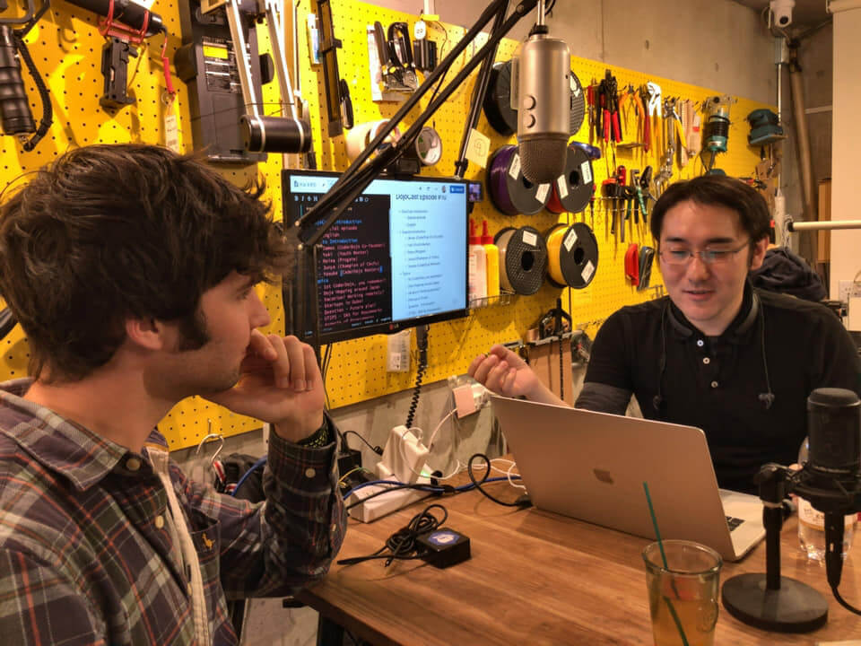

# 010 - Programming is Beyond a Job For Me

収録日: 2018/12/05
 

Podcasting with [James Whelton](https://twitter.com/whelton), [Junya Ishihara](https://twitter.com/jishiha), [Reina Masumoto](https://twitter.com/eriharu15), and [Yuki Mihashi](https://twitter.com/YukiMihashi). (And [Yosuke Toyota](https://twitter.com/youtoy) from the middle of recording.) This episode includes where James go around during Japan trip, his experiences in startup in Dubai, and differences in style between Startup and CoderDojo.

For English speakers, give it a listen from 1.35. ;) This podcast is conducted in English, but includes Japanese a little bit. But no worries! All Japanese talks are translated into English just after them by me (<a href="https://twitter.com/yasulab">@yasulab</a>).

-----

CoderDojo 共同創設者の [@whelton](https://twitter.com/whelton) と、CoderDojo 調布の [@jishiha](https://twitter.com/jishiha) さん、Progate の [@eriharu15](https://twitter.com/eriharu15)、Youth Mentor の [@YukiMihashi](https://twitter.com/YukiMihashi) さんと一緒に、James の日本旅行の話や、ドバイでのスタートアップの話、スタートアップと CoderDojo のスタイルの違いなどについて話しました。

(CoderDojo Mentor の [@youtoy](https://twitter.com/youtoy) さんも収録の途中から参加)

Photo Credit: <a href="https://twitter.com/youtoy">@youtoy</a>

## 📝 Shownote

- [James Whelton - Wikipedia](https://en.wikipedia.org/wiki/James_Whelton)
- [DojoCast - Highlight people around CoderDojo communities by Podcast 📻✨](/podcasts)
- [Progate - Learn to code, learn to be creative.](https://progate.com/)
- [プログラミング学習のProgate、全国のCoderDojoへ法人プランの無料提供開始](https://news.coderdojo.jp/2018/10/29/%E3%83%97%E3%83%AD%E3%82%B0%E3%83%A9%E3%83%9F%E3%83%B3%E3%82%B0%E5%AD%A6%E7%BF%92%E3%81%AEprogate%E3%80%81%E5%85%A8%E5%9B%BD%E3%81%AEcoderdojo%E3%81%B8%E6%B3%95%E4%BA%BA%E3%83%97%E3%83%A9%E3%83%B3/)
- [DojoCon Japan 2017](https://dojocon2017.coderdojo.jp/)
- [Unicorn Gundam Statue in Odaiba](https://fr.japantravel.com/tokyo/unicorn-gundam-statue-in-odaiba/41317)

---

- [CoderDojo Tokyo #1 と創始者ジェームズ・ウェルトン氏来日のまとめ](https://tech.a-listers.jp/2012/05/09/coderdojo-tokyo-1-james-whelton-in-japan/)
- [CoderDojo Foundation](https://coderdojo.com/foundation/)
- [CoderDojo Japan](https://coderdojo.jp/)
- [UTIPS - 共有しよう、家事のやり方](https://utips.life/)
- [Dojo Hopping](https://coderdojo.com/2017/11/22/coderdojo-and-me/)

## 👏 Special Thanks 

- 会場協力: [下北沢オープンソースCafe](https://osscafe.business.site/)
- 収録協力: [@cognitom](https://twitter.com/cognitom)
