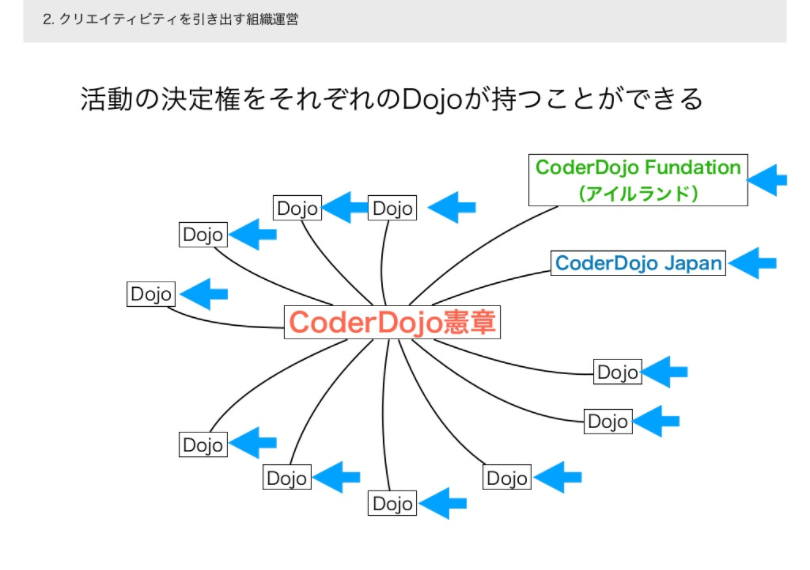

第三者からみた CoderDojo のイメージと、関係者からみた CoderDojo のイメージとを対比させながら、150坪もある新宿区高田馬場のシェアオフィス＆コワーキングスペース「[CASE Shinjuku](https://case-shinjuku.com/)」の仲居頭である[森下ことみ](https://www.facebook.com/kotomi.morishita.5)さんと、そのお仲間である[大串肇](https://www.facebook.com/hajime.ogushi)さん (通称: メガネさん) と一緒に収録しました。また、CoderDojo コミュニティが過去に遭遇した課題や、CoderDojo の広がり方の傾向、[CASE Shinjuku](https://case-shinjuku.com/) と [CoderDojo Japan](https://coderdojo.jp/) とが共通して共感していることなどについてお話ししました。

  
  

    <a class='btn-blue' href='https://www.youtube.com/watch?v=4T1kRlGPHwQ&list=PL94GDfaSQTmJxxnapafkApHYgQUJ6ABUU&index=8' target='_blank' rel='noopenner'><i class='fa fa-youtube'></i> YouTube で聴く </a>
    <a class='btn-blue' href='https://podcasters.spotify.com/pod/show/coderdojo-japan/episodes/008---PR--CASE-Shinjuku-euhiun' target='_blank' rel='noopenner'><i class='fas fa-podcast'></i> Podcast で聴く </a>
  

## Shownote

- [CASE Shinjuku](https://case-shinjuku.com/)
- [CoderDojoガイダンス](https://www.slideshare.net/togazo/coderdojo-introduction-jp) - SlideShare
- [技術的スキルを必要としない場面でのメンタリング](http://coderdojo-nishinomiya.info/mentoring-without-technical-skills/) - CoderDojo西宮 / 梅田

-----------

- [CoderDojo 下北沢](https://coderdojo-tokyo.connpass.com/)
- [CoderDojo さいたま](http://coderdojo-saitama.com/)
- [コワーキングスペース7F](https://office7f.com/)

-----------

- [CoderDojo Kata](https://coderdojo.jp/kata) (日本語)
- [CoderDojo Kata](http://kata.coderdojo.com/wiki/Home_Page) (英語)
- [CoderDojo 高田馬場](http://coderdojo-tdbb.com/)

### オマケ: CoderDojo コミュニティの特徴

引用元: [CoderDojoは人が集まる◯◯である説](https://www.slideshare.net/MasanoriNezumiya/coderdojo-79835899/1) - [CoderDojo 広島](http://www.coderdojo-hiroshima.com/)

