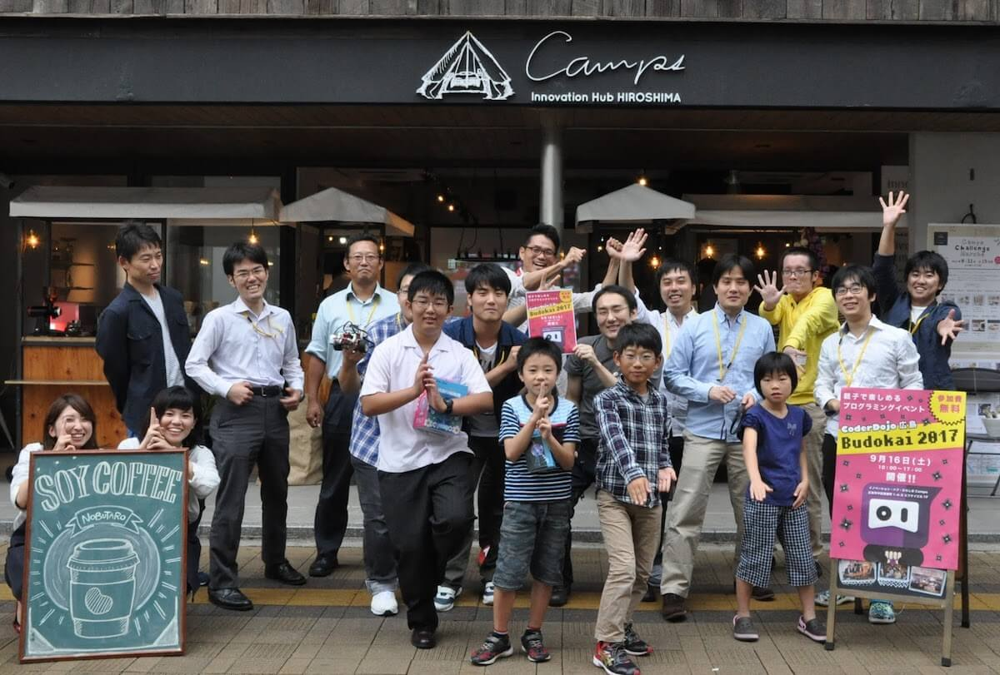

# 009 - Tsuyoi Hiroshima - DojoBudokai

収録日: 2017/09/16

Podcasting with <a href="https://www.facebook.com/masanori.nezumiya">鼠屋さん</a>と<a href="https://www.facebook.com/ando.mitsuaki">安藤さん</a>

CoderDojo 広島の活動をされている[鼠屋さん](https://www.facebook.com/masanori.nezumiya)と[安藤さん](https://www.facebook.com/ando.mitsuaki)をお伺いしてきました。CoderDojo 広島のことや DojoBudokai のこと、子どもと接するときに考えていることなどについてお話してきました。

DojoBudokai 2017 - CoderDojo 広島   
[http://www.coderdojo-hiroshima.com/budokai/2017-fall](http://www.coderdojo-hiroshima.com/budokai/2017-fall)

## Shownote

- [CoderDojo 広島](http://www.coderdojo-hiroshima.com/)
- [DojoBudokai](http://www.coderdojo-hiroshima.com/budokai)
- [CoderDojo 広島を知ろう！](https://www.slideshare.net/kamera25/coderdojo-73712494)

-----------

- [DojoCon Japan 2016](http://dojocon2016.coderdojo.jp/)
- [子供たちとプログラミングするときに大切ないくつかのこと](https://www.slideshare.net/KazuhiroAbe2/ss-65429736), Kazuhiro Abe
- [プログラミング教育の成り立ち](https://www.slideshare.net/maedaunderscore/ss-75942297), Yasuyuki Maeda

-----------

- [DojoCon Japan 2017](http://dojocon2017.coderdojo.jp/)
- [Japanese Raspberry Pi Users Group](http://www.raspi.jp/)
- [#007: Hack for Dojo with @teramotodaiki and @mjk_0513](/7)
